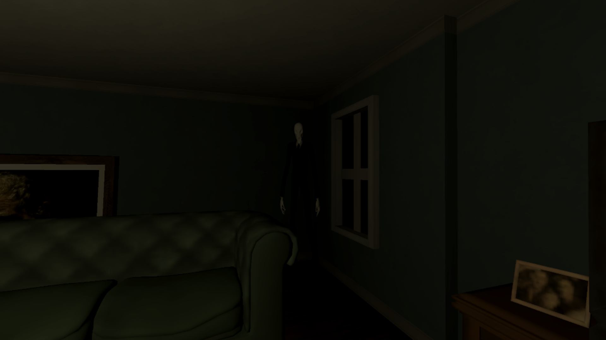
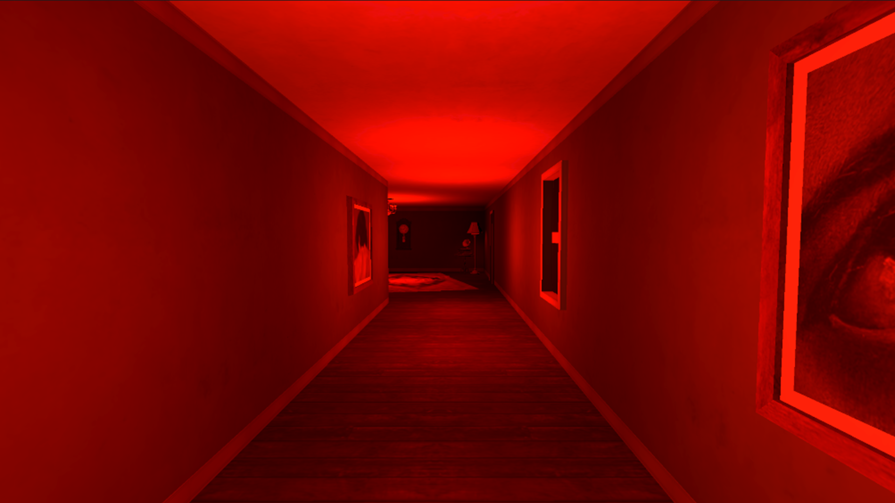
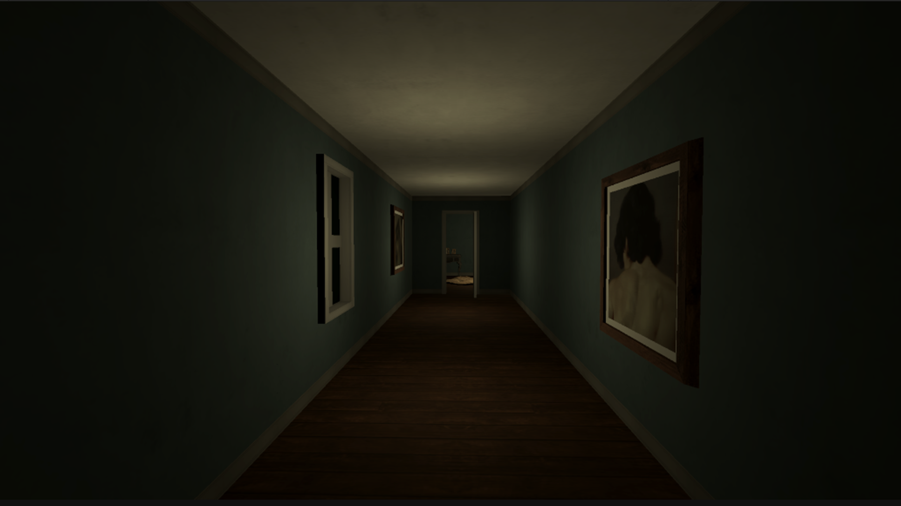
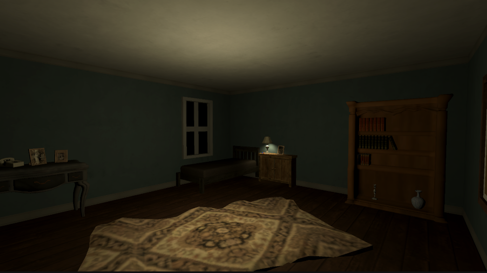
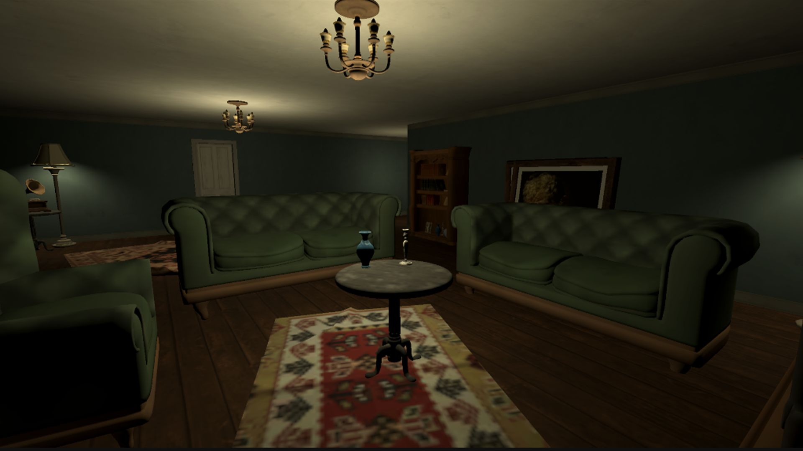

# Nightmare Pill

[Game Repo Link](https://github.com/parham182/AnomalyGame) 

## About

“Nightmare Pill” is a **3D horror game for mobile** in the Psychological Horror and Anomaly Horror genres, built around observation, memory, and detecting subtle environmental changes.

The player is trapped inside an old and mysterious mansion and must carefully examine their surroundings to progress. In each stage, parts of the environment may have changed from their previous state. The player must identify these changes and choose the appropriate pill based on whether or not an anomaly is present.

The core gameplay revolves around **careful observation, memorizing environmental details, and detecting subtle changes**. Anomalies can range from something as simple as a misplaced object or a changed painting to unsettling events such as the appearance of a shadow, a door changing position, or the presence of an unknown entity.

## Genre

Psychological Horror, Anomaly Horror, First-Person Horror

## Features

* First-Person Character Controller
* Anomaly Detection System
* Environmental Change System
* Interactive Pill System
* Player State Machine
* Interaction System
* Dynamic Horror Events
* Environmental Audio and Atmosphere
* Mansion Exploration
* Multiple Anomaly Types
* Mobile-Optimized Gameplay

## My Role

Game Developer

## Technologies

* Unity
* C#
* Git

## Screenshots

## Challenges

One of the main challenges was designing and implementing the anomaly detection gameplay loop while keeping the experience intuitive and engaging for a mobile horror game.

Another challenge was creating a system capable of detecting and managing different types of environmental changes while maintaining consistent game states and player interactions.

## Status

Completed
